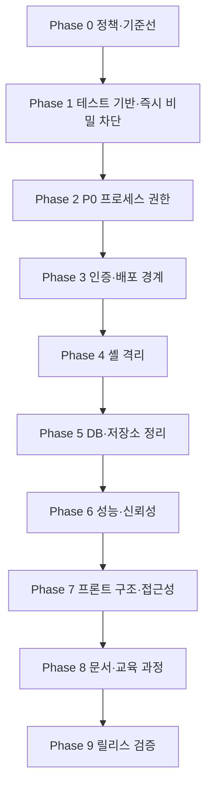

# Linux Web GUI 개선 실행 계획

기준 문서: `docs/evaluation.md`
작성일: 2026-07-29
목표: 평가에서 확인된 P0~P2 문제를 충돌 없이 단계적으로 수정하고,
각 단계가 자동 검증된 상태에서 다음 단계로 넘어간다.

## 1. 계획의 기본 원칙

이 계획은 보안 수정 전에 리팩터링이 진행되어 회귀가 생기는 것을 방지하고,
각 단계가 자동 검증된 상태에서 다음 단계로 넘어가도록 구성했다.

모든 작업은 다음 원칙을 지킨다.

1. P0 보안 문제를 기능 추가와 UI 리팩터링보다 먼저 처리한다.
2. 테스트 기반을 먼저 만들고 이후 변경은 실패 테스트 작성부터 시작한다.
3. 작업 범위 밖의 정리나 이름 변경을 함께 수행하지 않는다.
4. API 응답, 권한 및 WebSocket 메시지 계약을 변경할 때는 계약을 먼저 기록한다.
5. 각 작업은 하나의 독립 커밋 또는 작은 연속 커밋으로 완료한다.
6. 단계 완료 게이트를 통과하지 못하면 다음 단계로 이동하지 않는다.
7. 실행 DB와 사용자 데이터는 백업 없이 마이그레이션하거나 삭제하지 않는다.
8. 운영 배포는 P0와 P1 보안 단계가 모두 끝날 때까지 금지한다.
9. 에이전트는 넓은 읽기 전용 탐색과 보안 diff 적대적 리뷰에만 쓰고, 작은 기계적
   편집은 인라인으로 직접 수행한다.

## 2. 권장 정책 결정

구현을 시작하기 전에 아래 결정을 확정한다. 별도의 요구가 없다면
`권장 기본값`을 적용한다. 결정이 바뀌면 관련 작업의 인수 조건도 먼저 수정한다.

| 결정 ID | 결정 항목 | 권장 기본값 | 영향을 받는 작업 |
| --- | --- | --- | --- |
| DEC-01 | 사용자 ID 컬럼 | 현재 코드와 DB에 맞춰 `username` 유지 | DB-01, ADMIN-01 |
| DEC-02 | 관리자 권한 범위 | 전역 관리자 모델 사용, `created_by`는 감사 정보로만 사용 | ADMIN-01 |
| DEC-03 | 프로세스 종료 범위 | admin만, 교육용 `demo-*` 자식 프로세스만 종료 허용 | AUTHZ-01 |
| DEC-04 | WebSocket 인증 | access token 대신 60초 이하 일회성 ticket 사용 | SECRET-02, WS-01 |
| DEC-05 | 운영 TLS 정책 | 운영 프로필은 인증서가 없으면 시작 실패, HTTP는 개발 프로필만 허용 | DEPLOY-01 |
| DEC-06 | 셸 네트워크 | 기본 `none`, 별도 개발 설정에서만 제한적 허용 | SHELL-02 |
| DEC-07 | 모니터링 권한 | CPU·메모리·디스크·히스토리는 로그인 사용자, 연결 목록은 admin | AUTHZ-02 |
| DEC-08 | DB 보존 기간 | 원본 스냅샷 7일, 이후 삭제 | DATA-01 |

DEC-01과 DEC-02는 DB 및 관리자 API 구현 전에 반드시 확정해야 한다.
DEC-03~DEC-07은 보안 테스트의 기대 결과를 결정하므로 Phase 1 종료 전 고정한다.

## 3. 단일 에이전트 순차 실행

이 계획은 원래 여러 에이전트가 동시에 작업하는 것을 전제로 파일 잠금·Wave
병렬·통합 담당자 병합 같은 조율 장치를 두었다. 클로드 코드 단일 에이전트
순차 작업에서는 이 장치들이 오버헤드일 뿐이므로 다음 규칙으로 대체한다.

### 3.1 실행 규칙

- 한 브랜치에서 작업을 §15 커밋 권장 순서대로 하나씩 순차 진행한다.
- 파일 잠금 테이블, Wave 병렬, 통합 담당자 병합은 사용하지 않는다. `git diff`가
  곧 변경 기록이다.
- 작업별 독립 Test Agent 재검증은 하지 않는다. 검증은 Phase 게이트에서 1회 한다.
- 공유 계약(권한 행렬, API 응답, WebSocket 메시지)을 바꿀 때만 먼저
  `docs/contracts/`에 반영한 뒤 코드를 수정한다.
- 각 작업은 변경 전 실패 테스트 작성 → 구현 → 해당 테스트 통과 순으로 진행한다.

이하 각 Phase 본문의 `Wave`·`소유 파일`·`병렬 가능/금지` 표기는 멀티 에이전트
시절의 잔재이며 이 절의 순차 실행 모델로 대체된다. 이제 이들은 실행 순서와
관련 파일에 대한 참고 정보로만 읽는다. 각 작업의 `선행 작업`(의존성)과
`완료 조건`은 그대로 유효하다.

### 3.2 표준 완료 게이트

모든 Phase 완료 게이트는 아래 검사를 1회 실행해 통과를 확인한다. 실행은
`bash scripts/gate.sh` 하나로 한다(호출 규약은 `CLAUDE.md`의 검증 게이트 절 참조).

```
python -m pytest backend/tests
npm --prefix frontend run lint
npm --prefix frontend test -- --run
npm --prefix frontend run build
docker compose config --quiet          # 운영·개발 두 프로필
python scripts/security_scan.py
공백 검사                               # 줄바꿈 무관, 추적 diff + 미추적 파일
```

`git diff --check`는 미추적 파일을 검사하지 않고 index가 CRLF인 파일에서 오검출하므로
게이트 근거로 쓰지 않는다. 실행기의 공백 검사가 이를 대신하며 검사 범위는 더 넓다.

보안 경계를 바꾸는 Phase 3(인증·배포)과 Phase 4(셸 격리)는 위 표준 게이트에
더해 **실제 구동 검증**을 1회 추가한다(각 Phase 게이트 절에 명시). 나머지
Phase는 표준 게이트만으로 충분하다.

## 4. 전체 의존성 흐름



각 Phase는 이전 Phase의 완료 게이트를 전제로 한다.

## 5. Phase 0 — 정책 확정과 기준선 보존

### BASE-01: 현재 상태 기록

- 우선순위: 선행 작업
- 소유 파일: 새 문서 `docs/baseline.md`만
- 선행 작업: 없음
- 병렬 실행: 금지

작업 내용:

1. Git 상태와 현재 브랜치·커밋을 기록한다.
2. Python, Node, npm, Docker Compose 버전을 기록한다.
3. 현재 빌드·테스트 실패 결과를 재현해 기록한다.
4. 사용자 데이터 값은 기록하지 않고 DB 파일 경로와 스키마 버전만 기록한다.
5. DEC-01~DEC-08의 확정값을 기록한다.

완료 조건:

- 기존 사용자 변경을 건드리지 않고 기준선 문서만 추가된다.
- 현재 실패가 이후 수정으로 해결됐는지 비교할 수 있다.

### BASE-02: API·권한 계약 고정

- 우선순위: 선행 작업
- 소유 파일: 새 문서 `docs/contracts/security-contract.md`
- 선행 작업: BASE-01
- 병렬 실행: 금지

문서에 다음 권한 행렬을 확정한다.

| 기능 | 미인증 | viewer | admin |
| --- | --- | --- | --- |
| CPU·메모리·디스크·프로세스 조회 | 401 | 허용 | 허용 |
| 히스토리 조회 | 401 | 허용 | 허용 |
| 네트워크 인터페이스·트래픽·패킷 | 401 | 허용 | 허용 |
| 네트워크 연결·PID 조회 | 401 | 403 | 허용 |
| 프로세스 종료 | 401 | 403 | DEC-03 범위만 허용 |
| 사용자·감사 로그 관리 | 401 | 403 | 허용 |
| 모니터링 WebSocket ticket 발급 | 401 | 허용 | 허용 |
| 셸 WebSocket ticket 발급 | 401 | 403 | 허용 |
| 셸 파일 탐색·초기화 | 401 | 403 | 본인 세션만 허용 |

> 위 두 셸 행은 Phase 0 당시 확정값이다. OUT_OF_PLAN_CHANGE(2026-08-07)로 셸이
> admin 전용에서 인증된 전체 사용자(admin·viewer, 본인 세션만)로 개방됐다. 현재
> 목표 계약은 `docs/contracts/security-contract.md` §2, 결정 근거는
> `docs/re-progress.md`를 따른다.

완료 조건:

- 이후 백엔드와 프론트엔드가 참조할 단일 권한 계약이 존재한다.
- 정책 미결정 항목이 남아 있지 않다.

### Phase 0 완료 게이트

- DEC-01~DEC-08 확정
- 기준선과 권한 계약 검토 완료
- 프로덕션 코드 변경 없음

## 6. Phase 1 — 신뢰할 수 있는 테스트 기반

### Wave 1A

#### QA-01: 백엔드 pytest 기반 구성

- 우선순위: P1
- 소유 파일:
  - `backend/requirements.txt`
  - 새 파일 `backend/pytest.ini`
  - 새 디렉터리 `backend/tests/`
- 선행 작업: Phase 0
- 병렬 가능: QA-02

작업 내용:

1. pytest, pytest-asyncio와 테스트용 HTTP 클라이언트를 명시한다.
2. 임시 SQLite DB와 사용자 fixture를 만든다.
3. 기존 출력형 스크립트를 즉시 삭제하지 않고 `backend/test/legacy/` 대상으로
   분류할 계획을 세운다.
4. 최소 smoke test와 실패 시 non-zero 종료를 확인한다.
5. 운영 DB와 Docker를 사용하지 않는 테스트 환경을 만든다.

완료 조건:

- 프로젝트 루트에서 `python -m pytest backend/tests`가 실행된다.
- 의도적으로 실패하는 테스트는 종료 코드 1을 반환한다.
- 테스트가 추적 중인 SQLite DB를 변경하지 않는다.

#### QA-02: 프론트엔드 테스트·lint 기반 구성

- 우선순위: P1
- 소유 파일:
  - `frontend/package.json`
  - `frontend/package-lock.json`
  - 새 테스트 설정 파일
  - 새 디렉터리 `frontend/src/test/`
- 선행 작업: Phase 0
- 병렬 가능: QA-01

작업 내용:

1. clean install 기준으로 누락된 xterm 의존성을 복구한다.
2. Vitest, Testing Library 및 ESLint 명령을 추가한다.
3. AuthProvider와 ProtectedRoute smoke test를 작성한다.
4. `npm ci` 후 build가 재현되는지 확인한다.

완료 조건:

- `npm --prefix frontend ci`
- `npm --prefix frontend run lint`
- `npm --prefix frontend test -- --run`
- `npm --prefix frontend run build`

위 명령이 모두 성공한다.

### Wave 1B

#### SECRET-01: 기본 비밀과 기본 관리자 제거

- 우선순위: P0
- 소유 파일:
  - `backend/core/security.py`
  - `backend/main.py`
  - 새 파일 `backend/cli/create_admin.py`
  - 새 테스트 `backend/tests/test_bootstrap_security.py`
- 선행 작업: QA-01, QA-02
- 병렬 실행: 금지

작업 내용:

1. `SECRET_KEY`가 없거나 알려진 placeholder면 서버 시작을 실패시킨다.
2. `admin/admin1234` 자동 생성을 제거한다.
3. 관리자 생성은 명시적 CLI로만 수행하고 비밀번호를 인자로 노출하지 않는다.
4. 관리자 생성 결과에 비밀번호나 해시를 출력하지 않는다.

완료 조건:

- 기본 설정만으로 관리자 계정이 만들어지지 않는다.
- 약한 키로 운영 서버가 시작되지 않는다.
- CLI는 최초 관리자 생성과 중복 방지를 테스트한다.

### Wave 1C

#### SECRET-02: 토큰 로그 노출 즉시 차단

- 우선순위: P0
- 소유 파일:
  - `backend/routers/websocket.py`
  - `frontend/src/api/client.js`
  - `frontend/nginx.conf`
  - `frontend/nginx-http.conf`
  - 새 테스트 `backend/tests/test_secret_logging.py`
- 선행 작업: SECRET-01
- 병렬 실행: 금지

작업 내용:

1. 서버 로그에서 token과 전체 query string 출력을 제거한다.
2. 브라우저 콘솔에서 WebSocket 전체 URL 출력을 제거한다.
3. Nginx WebSocket location은 query string을 남기지 않는 별도 로그 형식을 쓴다.
4. 토큰 존재 여부조차 불필요하게 상세 출력하지 않는다.

완료 조건:

- 소스와 테스트 로그에서 JWT 원문이 발견되지 않는다.
- 정상·실패 WebSocket 연결 로그에는 request ID와 결과만 남는다.

### Wave 1D

#### QA-03: 기준 CI와 유지보수 가능한 보안 scan 구성

- 우선순위: P1
- PM 소유 파일: `.github/workflows/ci.yml`
- Back 소유 파일:
  - 새 파일 `scripts/security_scan.py`
  - 새 테스트 `backend/tests/test_security_scan.py`
- 선행 작업: SECRET-02
- 병렬 실행: 금지

작업 내용:

1. stdlib CLI `python scripts/security_scan.py [--root PATH]`를 추가한다.
2. production scope(`backend/main.py`, `backend/core/**/*.py`, `backend/routers/**/*.py`,
   `backend/cli/**/*.py`, `frontend/src/**/*.js|jsx`, `frontend/nginx*.conf`,
   `docker-compose.yml`)만 검사하고 tests·docs·venv·dist·node_modules는 제외한다.
3. `SECRET_ENV_FALLBACK`, `HARDCODED_CREDENTIAL`, `SENSITIVE_PY_LOG`,
   `SENSITIVE_JS_CONSOLE`, `NGINX_REQUEST_LOG`, `SCAN_INPUT_ERROR`만 category·상대 경로로
   출력하고 값·소스 줄은 출력하지 않는다. 발견·입력 오류는 non-zero다.
4. placeholder 거부 상수, 고정 안전 로그, 로그가 아닌 token URL 구성은 발견으로
   처리하지 않는다.
5. CI 마지막 단계는 `python scripts/security_scan.py`를 호출한다. 앞선 Python 설치,
   backend pytest, Node 설치, frontend clean install/lint/test/build, Compose 검증 순서는
   유지하며 soft failure를 두지 않는다.

완료 조건:

- fixture tree의 양성·음성·redaction·제외 경로 검증과 현재 저장소 clean scan이 통과한다.
- 독립 Test Agent가 scanner scope, non-zero 전파, CI 순서와 비노출 출력을 검증한다.

### Phase 1 완료 게이트

- `python -m pytest backend/tests`를 한 번 실행한다.
- 현재 lock hash에 대해 `npm --prefix frontend ci --no-audit --fund=false`를 한 번 실행한 뒤
  `npm ls`, lint, test, build를 실행한다.
- `docker compose config --quiet`, `python scripts/security_scan.py`, `git diff --check` 및
  새 작업 파일의 단일 재귀 trailing-whitespace 검사를 통과한다.
- backend test가 DB에 접근할 수 있으므로 추적 SQLite hash를 Gate 전후 한 번씩만 비교한다.
- GitHub hosted CI는 push 권한이 없으면 NOT_RUN으로 남길 수 있으나, 같은 명령의 로컬
  실행과 workflow 정적 검증은 통과해야 한다.

## 7. Phase 2 — P0 프로세스 종료 권한 제거

### Wave 2A

#### AUTHZ-01: 프로세스 종료 권한과 범위 제한

- 우선순위: P0
- 소유 파일:
  - `backend/routers/process.py`
  - `frontend/src/App.jsx`
  - `frontend/src/pages/Processes.jsx`
  - 새 테스트 `backend/tests/test_process_authorization.py`
  - 새 테스트 `frontend/src/pages/Processes.test.jsx`
- 선행 작업: Phase 1, DEC-03
- 병렬 실행: 금지

작업 내용:

1. 종료 API를 admin 전용으로 변경한다.
2. 종료 가능 프로세스를 DEC-03 allowlist로 제한한다.
3. viewer UI에서 Kill 버튼과 관리자 전용 동작을 제거한다.
4. 성공·거부·보호 PID 시나리오를 테스트한다.

완료 조건:

- 미인증 401, viewer 403, admin allowlist 성공이 자동 검증된다.
- API 문서와 UI의 권한이 일치한다.

### Phase 2 완료 게이트

- §3.2 표준 게이트 1회 통과
- AUTHZ-01의 P0 권한 행렬이 통과한다.

## 8. Phase 3 — 인증 계약과 배포 경계 통일

### Wave 3A

#### AUTHZ-02: REST 시스템 API 인증 적용

- 우선순위: P1
- 소유 파일:
  - `backend/routers/cpu.py`
  - `backend/routers/memory.py`
  - `backend/routers/disk.py`
  - `backend/routers/network.py`
  - `backend/routers/history.py`
  - 새 테스트 `backend/tests/test_monitor_authorization.py`
- 선행 작업: Phase 2, BASE-02
- 병렬 가능: ADMIN-01

작업 내용:

1. 라우터 또는 엔드포인트에 권한 계약을 적용한다.
2. 연결·PID 등 민감 정보는 admin으로 제한한다.
3. 프론트 요청 헤더와 401 처리 흐름을 확인한다.

완료 조건:

- BASE-02 권한 행렬 전체가 자동 테스트로 통과한다.

#### ADMIN-01: 관리자 범위 정책 통일

- 우선순위: P2
- 소유 파일:
  - `backend/routers/admin.py`
  - 새 테스트 `backend/tests/test_admin_scope.py`
- 선행 작업: Phase 2, DEC-02
- 병렬 가능: AUTHZ-02

작업 내용:

1. DEC-02에 따라 조회·생성·수정·삭제 predicate를 통일한다.
2. 마지막 활성 관리자 보호를 같은 트랜잭션 안에서 검증한다.
3. 두 관리자의 교차 접근과 동시 강등 테스트를 추가한다.

완료 조건:

- 관리자 범위가 모든 CRUD에서 동일하다.
- 동시 요청에도 최소 한 명의 활성 관리자가 남는다.

### Wave 3B

#### WS-01: 일회성 ticket과 DB 사용자 재검증

- 우선순위: P1
- 소유 파일:
  - `backend/core/security.py`
  - `backend/routers/websocket.py`
  - `backend/routers/shell.py`
  - `backend/routers/auth.py`
  - `frontend/src/api/client.js`
  - `frontend/src/components/Terminal.jsx`
  - `frontend/src/context/AuthContext.jsx`
  - 새 테스트 `backend/tests/test_websocket_authorization.py`
- 선행 작업: AUTHZ-02, SECRET-02, DEC-04
- 병렬 실행: 금지

계약:

1. REST Bearer 인증으로 용도별 ticket을 발급한다.
2. ticket은 60초 이하, 1회 사용, 목적이 `monitor` 또는 `shell`로 고정된다.
3. WebSocket 연결 시 DB에서 사용자의 활성 상태와 현재 role을 확인한다.
4. ~~셸 ticket은 admin에게만 발급한다.~~ OUT_OF_PLAN_CHANGE(2026-08-07)로 인증된
   전체 사용자(admin·viewer)에게 발급하도록 개방됐다. 비활성 사용자만 거부한다.
   현재 기준은 `docs/contracts/security-contract.md` §2·§3.
5. ticket은 로그에 남지 않으며 재사용할 수 없다.

완료 조건 (Phase 3 당시):

- 만료, 재사용, 목적 불일치, 비활성 사용자 및 viewer 셸 연결이 거부된다. (viewer
  셸 연결 거부는 위 OUT_OF_PLAN_CHANGE로 더 이상 유효하지 않음 — 비활성 사용자
  거부만 현재도 유효)
- 프론트엔드가 access token을 WebSocket URL에 넣지 않는다.

### Wave 3C

#### DEPLOY-01: Nginx 우회와 운영 HTTP 차단

- 우선순위: P1
- 소유 파일:
  - `docker-compose.yml`
  - `frontend/start.sh`
  - `frontend/nginx.conf`
  - `frontend/nginx-http.conf`
  - 필요 시 새 개발용 Compose override
- 선행 작업: WS-01
- 병렬 실행: 금지

작업 내용:

1. 백엔드의 호스트 `8000:8000` 공개를 제거하고 내부 `expose`만 사용한다.
2. 운영과 개발 Compose 프로필을 분리한다.
3. 운영 프로필은 인증서와 필수 환경변수가 없으면 시작하지 않는다.
4. HTTP fallback은 개발 프로필에서만 허용한다.
5. obsolete `version` 키를 제거한다.

완료 조건:

- 운영 구성에서 호스트가 8000 포트로 직접 접근할 수 없다.
- `docker compose config --quiet`가 경고 없이 통과한다.
- 개발 HTTP와 운영 HTTPS 동작이 명확히 분리된다.

### Phase 3 완료 게이트

- §3.2 표준 게이트 1회 통과
- REST·WebSocket 권한 행렬 통과
- access token이 URL과 로그에 없음
- Nginx 우회 차단
- 운영 필수 설정 fail-fast

**실제 구동 검증(1회):** mock/정적 검사만으로는 실제 동작을 보장하지 못하므로
이 게이트에서 스택을 실제로 기동해 다음을 직접 확인한다.

1. `docker compose up`으로 기동한다.
2. 미인증·viewer·admin 각각으로 권한 행렬 주요 엔드포인트를 `curl`로 타격해
   401/403/200이 계약(BASE-02)과 일치하는지 확인한다.
3. 실제 서버·Nginx 로그를 grep해 JWT·ticket 원문이 0건인지 확인한다.
4. 운영 프로필을 인증서 없이 기동하면 시작에 실패하는지 확인한다.

## 9. Phase 4 — Docker 셸 격리 강화

### SHELL-01: 파일 트리 경로 안전성

- 우선순위: P1
- 소유 파일:
  - `backend/routers/shell.py`
  - 새 파일 `backend/services/file_tree.py`
  - 새 테스트 `backend/tests/test_shell_file_tree.py`
- 선행 작업: Phase 3
- 병렬 실행: 금지

작업 내용:

1. `lstat`을 사용해 심볼릭 링크를 따라가지 않는다.
2. resolved path가 사용자 홈 아래인지 검증한다.
3. 전체 재귀 대신 디렉터리 단위 지연 로딩 API로 변경한다.
4. 최대 깊이, 항목 수, 응답 크기와 timeout을 설정한다.
5. 프론트 계약 변경은 이 작업에서 문서화만 하고 SHELL-02에서 반영한다.

완료 조건:

- 절대 경로, 상위 경로, 순환 링크와 대형 디렉터리 테스트 통과
- 호스트 홈 밖의 이름이나 메타데이터가 응답에 없음

### SHELL-02: 컨테이너 실행 권한 축소

- 우선순위: P1
- 소유 파일:
  - `backend/routers/shell.py`
  - `frontend/src/components/Terminal.jsx`
  - `frontend/src/components/FileExplorer.jsx`
  - `Dockerfile.webterm`
  - `docker-compose.yml`
  - 새 테스트 `backend/tests/test_shell_limits.py`
- 선행 작업: SHELL-01, DEC-06
- 병렬 실행: 금지

작업 내용:

1. 셸 기본 네트워크를 `none`으로 변경한다.
2. read-only rootfs, capability drop, no-new-privileges와 tmpfs를 검토·적용한다.
3. 사용자당 동시 세션 수와 전체 세션 수를 제한한다.
4. 컨테이너 시작·정리 timeout과 고아 컨테이너 정리 절차를 추가한다.
5. Docker 소켓 직접 사용을 최소 권한 프록시 또는 별도 실행 서비스로 분리한다.
6. SHELL-01의 지연 로딩 API에 맞춰 FileExplorer를 변경한다.

완료 조건:

- 셸에서 외부 네트워크와 Docker 소켓에 접근할 수 없다.
- 세션 한도, timeout 및 고아 컨테이너 정리가 자동 검증된다.
- 정상 터미널 입력·resize·파일 탐색 회귀 테스트가 통과한다.

### Phase 4 완료 게이트

- §3.2 표준 게이트 1회 통과
- 경로 탈출·링크 순환 방지
- 최소 권한 셸 실행
- 동시 세션과 자원 한도 검증
- Docker 관련 전체 테스트 통과

**실제 구동 검증(1회):** 셸 격리는 mock으로 보장할 수 없으므로 이 게이트에서
실제 셸 컨테이너를 기동해 다음을 직접 확인한다.

1. 실제 셸 컨테이너 1개를 기동한다.
2. 컨테이너 안에서 외부 네트워크(예: 외부 host ping/HTTP)가 실제로 차단되는지
   확인한다.
3. 컨테이너에서 Docker 소켓·호스트 파일시스템에 접근할 수 없는지 확인한다.
4. 사용자 홈 밖으로의 심볼릭 링크 경로 탈출이 실제로 거부되는지 확인한다.

## 10. Phase 5 — DB 마이그레이션과 저장소 정리

### DB-01: 스키마 버전 관리 도입

- 우선순위: P1
- 소유 파일:
  - `backend/main.py`
  - `backend/core/models.py`
  - `backend/requirements.txt`
  - `backend/migrations/`
  - 새 Alembic 설정과 migration 테스트
- 선행 작업: Phase 4, DEC-01
- 병렬 실행: 금지

작업 내용:

1. `username`을 최종 컬럼으로 고정한다.
2. 현재 모델과 반대인 rename 스크립트를 폐기 또는 명시적 no-op으로 대체한다.
3. 시작 시 임의 `ALTER TABLE`을 제거한다.
4. Alembic revision으로 `created_by`와 현재 스키마를 표현한다.
5. 빈 DB, 기존 DB 복사본, 이미 최신인 DB의 upgrade를 검증한다.

완료 조건:

- 앱 시작이 스키마 오류를 정상으로 숨기지 않는다.
- upgrade가 멱등적으로 검증되고 DB 백업·복구 절차가 문서화된다.

### REPO-01: venv와 실행 DB 추적 제거

- 우선순위: P1
- 소유 파일:
  - `.gitignore`
  - Git index의 `backend/.venv`, `backend/venv`
  - Git index의 실행 DB
  - 새 익명화 fixture 또는 DB 초기화 문서
- 선행 작업: DB-01
- 병렬 실행: 금지
- 주의: 삭제 범위를 확인한 뒤 별도 승인·백업 하에 수행

작업 내용:

1. 실제 로컬 파일을 즉시 삭제하지 않고 먼저 Git 추적만 제거한다.
2. 실행 DB는 안전한 백업 위치를 확인한 뒤 저장소에서 제외한다.
3. 테스트용 데이터는 익명화된 fixture로 새로 만든다.
4. Git 이력 재작성은 이 계획의 기본 범위에서 제외하고 별도 결정한다.
5. 4,000개 이상의 삭제가 다른 기능 변경과 섞이지 않도록 단독 커밋한다.

완료 조건:

- `git ls-files`에 venv, pyc와 실행 DB가 없다.
- clean clone에서 의존성 설치와 DB 초기화가 가능하다.
- 이 커밋에는 소스 기능 변경이 포함되지 않는다.

### Phase 5 완료 게이트

- §3.2 표준 게이트 1회 통과
- DB upgrade·rollback 검증
- 운영 데이터 백업 확인
- 저장소 생성물 추적 0건
- clean clone 재현 성공

## 11. Phase 6 — 성능과 신뢰성

### PERF-01: 단일 메트릭 수집과 공유 fan-out

- 우선순위: P2
- 소유 파일:
  - `backend/main.py`
  - `backend/routers/websocket.py`
  - `backend/services/scheduler.py`
  - 새 파일 `backend/services/metrics_collector.py`
  - 관련 스키마와 성능 테스트
- 선행 작업: Phase 5
- 병렬 실행: 금지

작업 내용:

1. 한 개의 백그라운드 수집기가 5초마다 immutable snapshot을 만든다.
2. WebSocket 연결은 최신 snapshot을 공유받는다.
3. 스케줄러는 같은 수집 결과를 재사용한다.
4. `psutil` 블로킹 호출은 executor로 이동한다.
5. 시작·종료 시 collector lifecycle을 명시한다.

완료 조건:

- 연결 수가 늘어도 수집 횟수가 증가하지 않는다.
- 1, 10, 50 연결 부하 테스트에서 이벤트 루프 지연 기준을 만족한다.

### PERF-02: 셸 subprocess 비동기 경계

- 우선순위: P2
- 소유 파일:
  - `backend/routers/shell.py`
  - 관련 셸 성능 테스트
- 선행 작업: PERF-01, SHELL-02
- 병렬 실행: 금지

작업 내용:

1. 컨테이너 시작·wait·삭제의 블로킹 구간을 executor 또는 비동기 subprocess로
   이동한다.
2. 취소와 timeout 시 cleanup이 한 번만 실행되도록 한다.

완료 조건:

- 느린 Docker 응답 중에도 health와 모니터링 API가 응답한다.

### DATA-01: 오류 상태와 보존 정책

- 우선순위: P2
- 소유 파일:
  - `backend/routers/cpu.py`
  - `backend/routers/memory.py`
  - `backend/routers/disk.py`
  - `backend/routers/network.py`
  - `backend/services/scheduler.py`
  - 관련 스키마와 테스트
- 선행 작업: PERF-02, DEC-08
- 병렬 실행: 금지

작업 내용:

1. broad exception 뒤의 0·빈 배열 반환을 구조화된 오류 또는 stale 상태로 바꾼다.
2. Linux·Windows의 `psutil` 필드 차이를 명시적으로 처리한다.
3. 보존 기간 이전 행을 SQL DELETE로 일괄 삭제한다.
4. 보존 작업을 스케줄러에 등록한다.

완료 조건:

- 실제 0값과 수집 실패를 API에서 구분할 수 있다.
- OS별 단위 테스트와 보존 경계 테스트가 통과한다.

### Phase 6 완료 게이트

- §3.2 표준 게이트 1회 통과
- 동시 연결 부하 기준 통과
- 실패와 0값 구분
- DB 보존 정책 자동 실행

## 12. Phase 7 — 프론트엔드 구조와 접근성

Phase 7은 파일 소유권이 분리되므로 Wave 7A의 세 작업만 병렬 진행할 수 있다.

### Wave 7A

#### FRONT-01: Filesystem 페이지 분리

- 우선순위: P2
- 소유 파일:
  - `frontend/src/pages/Filesystem.jsx`
  - `frontend/src/styles/Filesystem.css`
  - 새 디렉터리 `frontend/src/features/filesystem/`
- 선행 작업: Phase 6
- 병렬 가능: FRONT-02, FRONT-03

분리 대상:

- 가상 파일시스템 모델
- 권한 변환 유틸리티
- 명령 기록 Hook
- 트리, 상세 패널 및 모달

완료 조건:

- 기존 교육용 동작을 테스트로 보존한다.
- 가상 환경임을 페이지 상단에 항상 표시한다.

#### FRONT-02: NetworkDiagnostics와 Users 분리

- 우선순위: P2
- 소유 파일:
  - `frontend/src/pages/NetworkDiagnostics.jsx`
  - `frontend/src/pages/Users.jsx`
  - `frontend/src/styles/NetworkDiagnostics.css`
  - `frontend/src/styles/UsersAdmin.css`
  - 새 feature 모듈과 테스트
- 선행 작업: Phase 6
- 병렬 가능: FRONT-01, FRONT-03

작업 내용:

1. 네트워크 도구 정의, 입력 검증, 시뮬레이터와 결과 UI를 분리한다.
2. 화면에 “교육용 시뮬레이션이며 실제 네트워크 요청을 보내지 않음”을 표시한다.
3. 사용자 API Hook과 목록·생성 UI를 분리한다.

완료 조건:

- 실제 실행으로 오인할 문구가 없다.
- 관리자 CRUD UI 테스트가 통과한다.

#### FRONT-03: 공통 접근성 개선

- 우선순위: P2
- 소유 파일:
  - `frontend/src/components/`
  - `frontend/src/pages/Dashboard.jsx`
  - `frontend/src/pages/Network.jsx`
  - `frontend/src/styles/` 중 FRONT-01·02가 소유하지 않은 파일
- 선행 작업: Phase 6
- 병렬 가능: FRONT-01, FRONT-02

작업 내용:

1. 클릭 가능한 `div`와 `th`를 키보드 조작 가능한 요소로 변경한다.
2. label, `aria-sort`, focus-visible 및 상태 알림을 적용한다.
3. 배열 index key를 안정적인 식별자로 교체한다.
4. 반응형 표와 터미널 focus 흐름을 검증한다.

완료 조건:

- 키보드만으로 로그인 후 주요 페이지를 사용할 수 있다.
- 자동 접근성 검사에서 심각한 위반이 없다.

### Wave 7B

#### FRONT-04: 공통 API와 의존성 정리

- 우선순위: P2
- 소유 파일:
  - `frontend/src/api/client.js`
  - `frontend/package.json`
  - `frontend/package-lock.json`
  - 미사용 CSS
- 선행 작업: FRONT-01, FRONT-02, FRONT-03
- 병렬 실행: 금지

작업 내용:

1. 공통 JSON 파싱, 401 처리, timeout과 오류 타입을 구현한다.
2. `axios`, `chart.js`, `react-chartjs-2` 등 미사용 의존성을 확인 후 제거한다.
3. 미사용 CSS와 import를 제거한다.
4. 번들 크기를 Phase 1 기준선과 비교한다.

완료 조건:

- lint, test, build 통과
- 미사용 의존성·스타일 0건
- 인증 만료 처리 방식이 모든 페이지에서 동일하다.

### Phase 7 완료 게이트

- §3.2 표준 게이트 1회 통과
- 주요 페이지 회귀·접근성 테스트 통과
- clean frontend build 성공

## 13. Phase 8 — 문서와 교육 과정 정합화

### DOC-01: README와 운영 문서 갱신

- 우선순위: P2
- 소유 파일:
  - `README.md`
  - `backend/test/WEBSOCKET_TEST_REPORT.md`
  - `backend/test/DATABASE_INTEGRATION_GUIDE.md`
  - 새 운영·로컬 개발 문서
- 선행 작업: Phase 7
- 병렬 실행: 금지

문서화할 내용:

1. 실제 디렉터리 구조
2. 로컬 개발과 Docker 운영 실행 방법
3. 현재 API·권한 행렬
4. 5초 WebSocket 주기와 ticket 인증
5. 최초 관리자 생성 CLI
6. 운영 TLS 필수 조건
7. 셸의 제한과 Docker 보안 경계
8. 테스트·lint·build 명령
9. OS별 `psutil` 차이와 문제 해결 방법

기존 “모든 테스트 통과” 보고서는 현재 자동 검사 결과로 대체하고 과거 결과임을
명확히 표시한다.

### STUDY-01: 단계별 학습 과제 추가

- 우선순위: P2
- 소유 파일:
  - 새 디렉터리 `docs/tutorials/`
  - `docs/LEARNING_LOG.md`의 템플릿 부분
- 선행 작업: DOC-01
- 병렬 실행: 금지

권장 학습 순서:

1. REST와 Pydantic
2. JWT와 권한 행렬
3. WebSocket ticket과 로그 보안
4. 비동기 수집과 이벤트 루프
5. SQLite migration과 보존 정책
6. Nginx TLS와 우회 차단
7. Docker 셸 격리

각 과제에는 목표, 관련 파일, 위험 사항, 실패 테스트, 완료 테스트와 복습 질문을
포함한다.

### Phase 8 완료 게이트

- §3.2 표준 게이트 1회 통과
- 문서 명령을 clean clone에서 그대로 실행할 수 있다.
- 실제 기능과 시뮬레이션이 명확히 구분된다.
- README의 API와 OpenAPI 경로가 일치한다.

## 14. Phase 9 — 릴리스 검증

### RELEASE-01: 최종 통합 검사

- 우선순위: 릴리스 게이트
- 소유 파일: 원칙적으로 없음, 필요한 수정은 별도 작업으로 되돌려 처리
- 선행 작업: Phase 8
- 병렬 실행: 금지

필수 검사(§3.2와 동일하며 `bash scripts/gate.sh`로 1회 실행한다):

```text
python -m pytest backend/tests
npm --prefix frontend ci
npm --prefix frontend run lint
npm --prefix frontend test -- --run
npm --prefix frontend run build
docker compose config --quiet
python scripts/security_scan.py
공백 검사
```

추가 수동 검사(3·5·6항은 Phase 3·4 게이트의 실제 구동 검증에서 이미 1회
실행됐으므로 여기서는 재확인한다):

1. 미인증·viewer·admin 권한 행렬
2. JWT와 ticket이 서버·Nginx·브라우저 로그에 남지 않음
3. viewer 프로세스 종료 거부
4. 비활성화된 사용자의 REST·WebSocket 접근 거부
5. 셸 네트워크·Docker 접근 차단
6. 심볼릭 링크 경로 탈출 방지
7. 기존 DB 복사본 migration과 rollback
8. 50개 모니터링 WebSocket 부하
9. 키보드 기반 주요 화면 사용
10. 운영 프로필의 HTTP 및 8000 직접 접근 차단

### RELEASE-02: 재평가

`docs/evaluation.md`와 같은 기준으로 다시 평가한다.

목표 점수:

| 관점 | 현재 | 최소 목표 |
| --- | ---: | ---: |
| 시니어 개발자 | 46 | 75 이상 |
| 학습자 | 63 | 80 이상 |

릴리스 조건:

- P0 미해결 0건
- P1 미해결 0건
- 필수 자동 검사 모두 통과
- 실행하지 못한 필수 검사 0건
- 운영 제한사항 문서화

## 15. 커밋 권장 순서

다음 순서를 유지하면 공유 파일 충돌과 대형 롤백을 줄일 수 있다.

1. `docs: record baseline and security contracts`
2. `test: establish backend pytest suite`
3. `test: establish frontend test and lint suite`
4. `security: remove default secrets and admin bootstrap`
5. `security: redact websocket credentials from logs`
6. `ci: add clean build, test and source security scan workflow`
7. `security: restrict process termination`
8. `security: enforce monitoring authorization`
9. `security: unify admin scope`
10. `security: add one-time websocket tickets`
11. `deploy: close backend port and require production TLS`
12. `security: constrain shell filesystem traversal`
13. `security: harden shell container runtime`
14. `db: introduce versioned migrations`
15. `chore: untrack virtualenvs and runtime databases`
16. `perf: share metric collection`
17. `perf: isolate shell blocking operations`
18. `reliability: expose metric errors and enforce retention`
19. `refactor: split frontend feature modules`
20. `a11y: improve keyboard and screen-reader support`
21. `chore: consolidate frontend API and dependencies`
22. `docs: synchronize operation and learning guides`
23. `release: verify and reevaluate`

저장소 대량 삭제 작업인 15번은 다른 변경과 절대 합치지 않는다.

## 16. 작업 체크리스트

각 작업 완료 시 아래 항목을 확인한다.

- [ ] 선행 작업(의존성)이 완료됐다.
- [ ] 변경 전 실패하는 테스트를 추가했다.
- [ ] 변경 후 해당 테스트가 통과한다.
- [ ] 작업 범위 밖의 파일을 함께 정리·변경하지 않았다.
- [ ] Phase 게이트(§3.2 표준 게이트, 보안 Phase는 실제 구동 포함)를 1회 통과한다.
- [ ] 로그와 diff에 비밀정보가 없다.
- [ ] DB 위험도에 맞춰 hash 또는 백업·upgrade·rollback을 확인했다.
- [ ] 공유 계약 변경은 같은 작업에서 `docs/contracts/`에 반영했다.
- [ ] README에 반영할 변경은 DOC-01 작업 목록에 기록했다.
- [ ] 알려진 제한사항을 완료 보고에 기록했다.

## 17. 계획 완료 정의

다음 조건을 모두 만족해야 이 개선 계획을 완료로 본다.

- 기본 자격 증명과 알려진 기본 JWT 키가 없다.
- access token과 WebSocket ticket 원문이 로그에 남지 않는다.
- 모든 REST·WebSocket·위험 동작에 서버 측 권한 검사가 있다.
- Docker 셸이 호스트 Docker 권한과 불필요한 네트워크를 갖지 않는다.
- 파일 트리가 사용자 홈을 벗어나지 않는다.
- DB migration과 보존 정책이 자동 검증된다.
- venv와 실행 DB가 Git에 추적되지 않는다.
- 테스트가 실패를 성공으로 보고하지 않는다.
- clean clone에서 install, test, build와 Compose 검증이 재현된다.
- 실제 기능과 교육용 시뮬레이션이 UI와 문서에서 명확히 구분된다.
- 시니어 개발자 재평가 75점 이상, 학습자 재평가 80점 이상을 달성한다.
